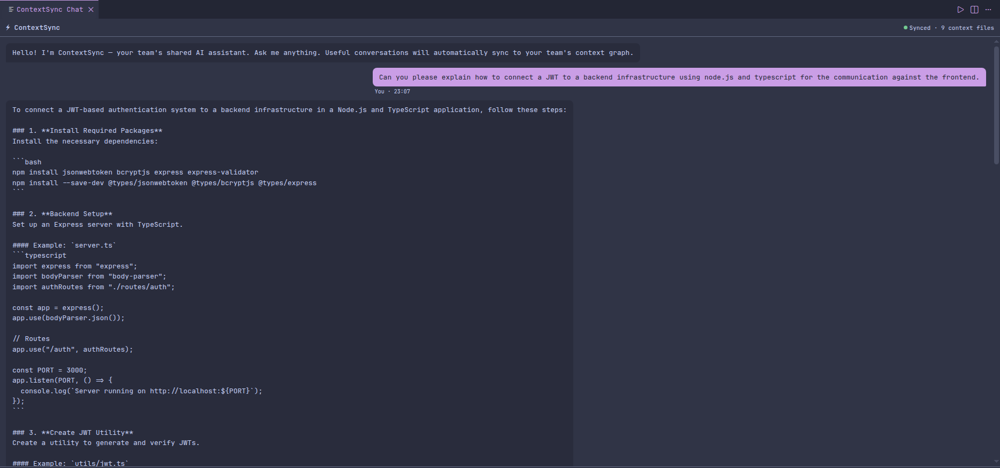
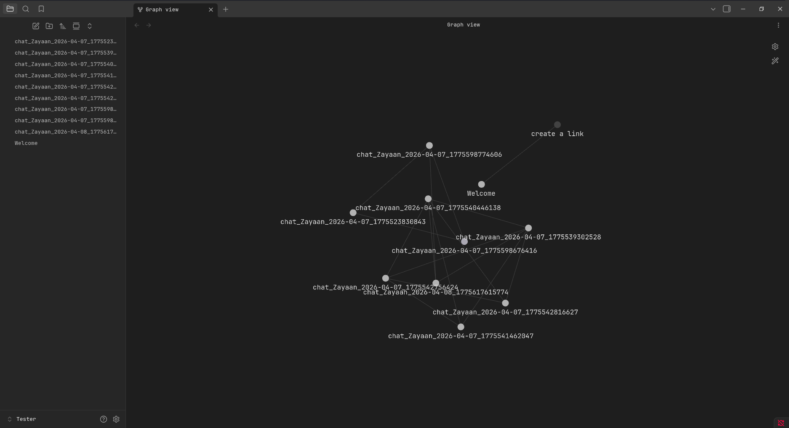

# ContextSync

> **Stop re-explaining your code to AI.** Collaborative context sharing for VS Code teams.

ContextSync lets  teams share AI conversation context automatically.
Every chat is saved as a structured `.md` file, synced via OneDrive to your
team's Obsidian vault, and injected as context built into every team member's AI chats.

**New Version:**
Directly integrate with your vscode's github copilot by using @contextsync before a message.

**Currently only for github copilot - More model support coming soon.**

Why?
1. **Team Memory:** Enables collaboration across dev teams
2. **Zero Effort:** Helps AI remember context about you
3. **Locally Controled:** Sync your context in real time with others

Find it at:
https://marketplace.visualstudio.com/items?itemName=ZayaanBhanwadia.context-sync&ssr=false#overview

| Local Context Generation | Real-time Team Sync |
| :---: | :---: |
|  |  |
---

## How It Works

```
You chat in VS Code
      ↓
ContextSync saves chat as .md (chat_zayaan_2025-01-15_001.md)
      ↓
OneDrive syncs .md to the team vault
      ↓
Bob opens VS Code → ContextSync loads Zayaan's .md
      ↓
Bob's AI chat has Zayaan's context automatically
```

---

## Setup

### 1. Install dependencies
```bash
npm install
npm run compile
```

### 2. Configure settings (VS Code Settings → search "ContextSync")

| Setting | Description | Example |
|---|---|---|
| `contextSync.syncFolder` | Path to your OneDrive/Obsidian folder | `/Users/zayaan/OneDrive/team-context` |
| `contextSync.username` | Your display name for file naming | `zayaan` |
| `contextSync.maxContextFiles` | Max context files injected per request | `5` |

### 3. Open the chat
Run command: **ContextSync: Open Chat** (`Ctrl+Shift+P`)

---

## File Format

Each chat session produces one `.md` file:

```md
---
id: zayaan-01-15_1736934720000
author: zayaan
topic: "How should we structure the auth middleware"
tags: [auth, backend, typescript]
created: 2025-01-15T10:32:00Z
updated: 2025-01-15T10:45:00Z
---

## Summary
Decided to use JWT with 15-minute expiry and refresh token rotation...

## Key Decisions
- JWT with 15min expiry + refresh token rotation
- Auth middleware lives in /packages/auth

## Context Links
- [[chat_bob_2025-01-14_003]]

## Transcript
...
```

---

## Project Structure

```
src/
├── extension.ts          # Entry point, registers commands
├── types.ts              # Shared TypeScript types
├── chat/
│   ├── ChatPanel.ts      # WebviewPanel lifecycle
│   └── ChatHandler.ts    # LM API calls + context injection
├── context/
│   ├── ContextManager.ts # Loads/parses .md files, builds context blocks
│   └── FileWatcher.ts    # Watches sync folder for changes
├── markdown/
│   └── MarkdownExporter.ts  # Exports sessions to structured .md
└── webview/
    └── chat.html         # Chat UI (vanilla JS)
```

---

**Want to Contribute?**
Find the project at:
https://github.com/ZayaanB/Context-Sync

**Note for Contributors:** Updating the GitHub repository does **not** automatically update the extension for users. To release updates, bump the version in `package.json` and run `vsce publish`.
