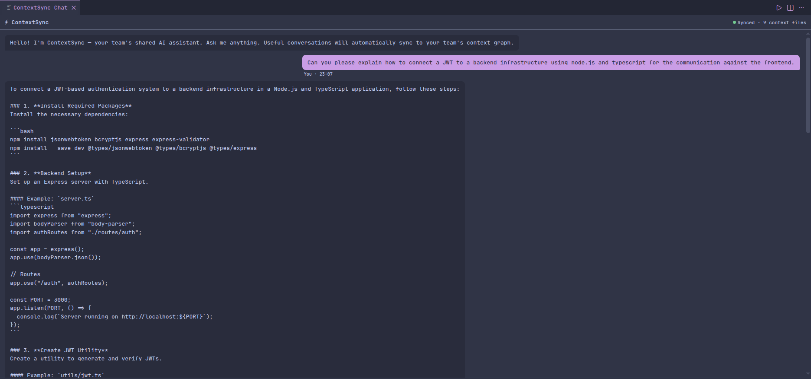
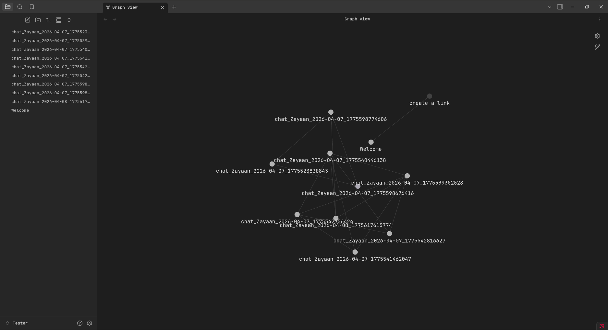

# ContextSync

> **Stop re-explaining your code to AI.** Collaborative context sharing for VS Code teams.

ContextSync lets teams share AI conversation context automatically.
Every chat is saved as a structured `.md` file, synced via OneDrive to your
team's Obsidian vault, and injected as context into every team member's AI chats.

**Works with GitHub Copilot, Claude (Anthropic API), ChatGPT (OpenAI API), and any VS Code language model provider.**

Why?
1. **Team Memory:** Enables collaboration across dev teams
2. **Zero Effort:** Context is saved and shared automatically
3. **Locally Controlled:** Sync in real time and hide conversations with privacy mode
4. **Direct Integration:** Use `@contextsync` directly in Copilot chat

[Install from the VS Code Marketplace](https://marketplace.visualstudio.com/items?itemName=ZayaanBhanwadia.context-sync)

| Local Context Generation | Real-time Team Sync |
| :---: | :---: |
|  |  |
---

## How It Works

```
You chat in VS Code
      ↓
ContextSync saves chat as .md (chat_zayaan_2025-01-15_001.md)
      ↓
OneDrive syncs .md to the team vault
      ↓
Bob opens VS Code → ContextSync loads Zayaan's .md
      ↓
Bob's AI chat has Zayaan's context automatically
```

---

## Setup

### 1. Install dependencies
```bash
npm install
npm run compile
```

### 2. Configure settings (VS Code Settings → search "ContextSync")

| Setting | Description | Example |
|---|---|---|
| `contextSync.syncFolder` | Path to your OneDrive/Obsidian folder | `/Users/zayaan/OneDrive/team-context` |
| `contextSync.username` | Your display name for file naming | `zayaan` |
| `contextSync.maxContextFiles` | Max context files injected per request | `5` |
| `contextSync.anthropicModels` | Anthropic models shown once a key is stored | `["claude-sonnet-4-5"]` |
| `contextSync.openaiModels` | OpenAI models shown once a key is stored | `["gpt-4o"]` |

### 3. Choose your AI provider

ContextSync talks to models three ways — use any or all:

| Provider | How |
|---|---|
| **GitHub Copilot** | Just sign in — all Copilot models (including its Claude/GPT models) appear in the model picker |
| **Claude (Anthropic API)** | Run **ContextSync: Set Anthropic API Key** from the command palette and paste your key |
| **ChatGPT (OpenAI API)** | Run **ContextSync: Set OpenAI API Key** and paste your key |
| **Other LM providers** | Any extension that registers models with VS Code's Language Model API shows up automatically |

API keys are stored in your OS keychain via VS Code SecretStorage — never in
settings files. Run the same command and submit an empty input to clear a key.
Edit `contextSync.anthropicModels` / `contextSync.openaiModels` to change which
model IDs appear in the picker.

### 4. Open the chat
Run **ContextSync: Open Chat** from the command palette (`Ctrl+Shift+P`),
or type `@contextsync` in GitHub Copilot chat (the `@contextsync` participant
requires Copilot since it runs inside Copilot Chat).

---

## File Format

Each chat session produces one `.md` file:

```md
---
id: zayaan-01-15_1736934720000
author: zayaan
topic: "How should we structure the auth middleware"
tags: [auth, backend, typescript]
created: 2025-01-15T10:32:00Z
updated: 2025-01-15T10:45:00Z
---

## Summary
Decided to use JWT with 15-minute expiry and refresh token rotation...

## Key Decisions
- JWT with 15min expiry + refresh token rotation
- Auth middleware lives in /packages/auth

## Context Links
- [[chat_bob_2025-01-14_003]]
```

---

## Project Structure

```
src/
├── extension.ts          # Entry point, registers commands
├── types.ts              # Shared TypeScript types
├── chat/
│   ├── ChatPanel.ts      # WebviewPanel lifecycle
│   └── ChatHandler.ts    # Prompt assembly + context injection
├── context/
│   ├── ContextManager.ts # Loads .md files, builds context blocks
│   ├── markdownParsing.ts# Pure parsing helpers (unit tested)
│   └── FileWatcher.ts    # Watches sync folder for changes
├── llm/
│   ├── ModelRouter.ts    # Routes to Copilot / Anthropic / OpenAI
│   └── directClients.ts  # Direct Anthropic + OpenAI API clients
├── markdown/
│   └── MarkdownExporter.ts  # Exports sessions to structured .md
├── test/
│   └── markdownParsing.test.ts  # Unit tests (npm test)
└── webview/
    └── chat.html         # Chat UI (vanilla JS)
```

---

## Contributing

Find the project at https://github.com/ZayaanB/Context-Sync

**Note:** Updating the GitHub repository does **not** automatically update the extension for users. To release, bump the version in `package.json` and run `vsce publish` (requires a VS Code publisher account).
